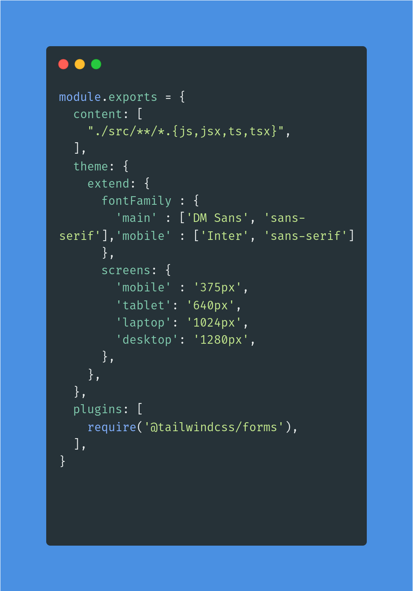

# THEME CONFIGURATION
The theme section of the tailwind.config.js file is where we defined our project’s type scale, fonts, breakpoints,and more.

## Theme Structure
This section sets the default values for a whole range of stuff such as screens, colors, spacing, animation, fontFamily e.t.c used by tailwind if no values are defined. However, any values that are defined here are used in place of the default values.

The *theme* object contains keys for the *font* and *screens* as well as a key for each customizable core plugin.

### Screens
The *screens* key allows one to customize the responsive breakpoints in the project.
The keys are your screen names (used as the prefix for the responsive utility variants Tailwind generates, like *md:text-center*), and the values are the *min-width* where that breakpoint should start.

In this project device names were used instead of sizes.

## Extend Section
Any values defined in this section are used in addition to the default values.

## Content Section
In this section, tailwind 'looks' into the *src directory* and goes as many folders deep as there are and finds all file types as specified i.e html, js, jsx, tsx

## Plugins Section
This is where all thrid party plugins are defined. in this project being the tailwind forms.